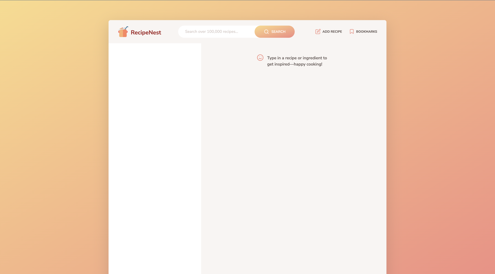

# RecipeNest 🍳

**Discover, Create, and Keep Your Culinary Favourites**

RecipeNest is a modern web application that allows users to search, view, bookmark, and create their own recipes. Built with vanilla JavaScript using the MVC (Model-View-Controller) architecture pattern, it provides a seamless cooking experience with over 100,000+ recipes at your fingertips.

## Screenshots

### Homepage


### Pizza Search Results


### Recipe View


### Bookmarked Recipes


### Add Recipe


## ✨ Features

- **🔍 Recipe Search**: Search through a vast database of over 100,000 recipes
- **📖 Detailed Recipe View**: View comprehensive recipe details including ingredients, cooking time, and servings
- **⚖️ Dynamic Servings**: Adjust recipe servings with automatic ingredient quantity recalculation
- **🔖 Bookmarking System**: Save your favorite recipes with persistent local storage
- **📝 Add Custom Recipes**: Create and upload your own recipes to the database
- **📄 Pagination**: Navigate through search results with intuitive pagination
- **📱 Responsive Design**: Works seamlessly across desktop and mobile devices


## 🛠️ Technologies Used

- **Frontend**: HTML5, CSS3 (Sass), Vanilla JavaScript (ES6+)
- **Architecture**: MVC (Model-View-Controller) Pattern
- **API**: Forkify API for recipe data
- **Storage**: Local Storage for bookmarks persistence
- **Build Tools**: Parcel (implied from module structure)


## 🏃‍♂️ Getting Started

### Prerequisites

- Node.js (v14 or higher)
- npm or yarn package manager

### Installation

1. **Clone the repository**
   ```bash
   git clone https://github.com/yourusername/recipenest.git
   cd recipenest
   ```

2. **Install dependencies**
   ```bash
   npm install
   ```

3. **Start the development server**
   ```bash
   npm start
   ```

4. **Open your browser**
   Navigate to `http://localhost:1234` (or the port shown in your terminal)

### Building for Production

```bash
npm run build
```

## 📖 Usage

### Searching for Recipes
1. Enter a recipe name or ingredient in the search bar
2. Browse through paginated results
3. Click on any recipe to view detailed information

### Viewing Recipe Details
- See cooking time, servings, and complete ingredient list
- Adjust servings using the +/- buttons (ingredients auto-calculate)
- Click the bookmark icon to save recipes
- Visit the original recipe source for cooking directions

### Managing Bookmarks
- Access bookmarks via the bookmark icon in the navigation
- Bookmarks persist between browser sessions
- Remove bookmarks by clicking the bookmark icon again

### Adding Custom Recipes
1. Click "Add recipe" in the navigation
2. Fill in the recipe details and ingredients
3. Use the format: "Quantity,Unit,Description" for ingredients
4. Submit to add your recipe to the database


## 🏗️ Architecture

RecipeNest follows the MVC architectural pattern:

- **Model** (`model.js`): Manages application state and API interactions
- **Views** (`views/`): Handle DOM manipulation and user interface updates  
- **Controller** (`controller.js`): Coordinates between models and views, handles user interactions

### Key Design Patterns

- **Publisher-Subscriber**: Views publish events, controller subscribes to handle them
- **Module Pattern**: Each component is organized as an ES6 module
- **Class Inheritance**: Views extend a base `View` class for shared functionality


## 📄 License

This project is licensed under the MIT License - see the [LICENSE](LICENSE) file for details.

## 🙏 Acknowledgments

- Recipe data provided by [Forkify API](https://forkify-api.jonas.io/)
- Icons from [Heroicons](https://heroicons.com/)
- Built as part of modern JavaScript development learning

---

<div align="center">
  <p>Made with ❤️ and JavaScript</p>
  <p>Happy Cooking! 👨‍🍳👩‍🍳</p>
</div>